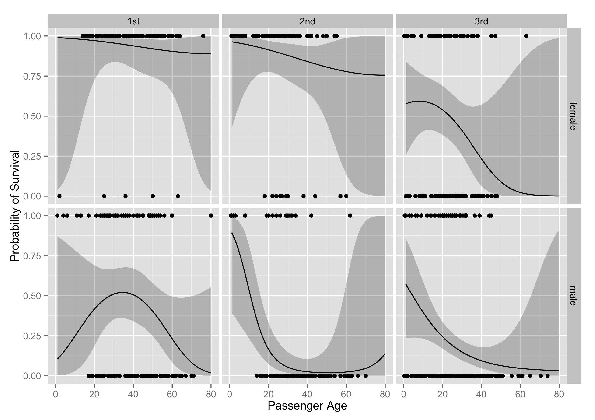

title: Analyzing Data from the Titanic
type: post
date: 2013-01-06
summary: predicting who survived the Titanic using a GLM and a GAM
tags: [Statistics, Computing]

I ran across data from the Titanic a week or two ago, and I thought I'd do a bit of analysis. The data has an interesting history, which you can read about [here](http://bit.ly/UteVOk). It turns out that this data is also the subject of a [Kaggle competition](http://www.kaggle.com/c/titanic-gettingStarted). This has resulted in some pretty cool [stuff](https://github.com/matthagy/titanic-families). The goal is to predict who survived and who died given a few features for each passenger.

The variables I will look at are class (which proxies for socioeconomic status), sex of the passenger, their age (fractional ages for infants), and the number of siblings and/or whether the passenger had a spouse on board (the data description link above has all the coding rules and such). Since the missing values in these variables are probably/hopefully missing completely at random I just omit the missing values. I split the data evenly into a training set and a testing set.

	:::r
	set.seed(1987)
	pkgs <- c("ggplot2", "mgcv", "MASS")
	invisible(lapply(pkgs, require, character.only = TRUE))

	load(url('http://biostat.mc.vanderbilt.edu/wiki/pub/Main/DataSets/titanic3.sav'))
	titanic3 <- na.omit(titanic3[, -c(3,8:14)])
	titanic3$class_sex <- apply(titanic3, 1,
	                            function(x) paste(x[1], x[3], collapse = "_"))
    titanic3$class_sex <- factor(titanic3$class_sex)
	train <- titanic3[sample(row.names(titanic3),
							 size = round(nrow(titanic3) / 2)), ]
	test <- titanic3[!(row.names(titanic3) %in% row.names(train)), ]

I estimate a glm with a logit link first. I squared the age variable since it seemed pretty likely that age has non-linear effects and interact sex with class and age, since there might be differential rates of survival by sex within classes (`x1 * x2` expands to `x1 + x2 + x1:x2` and the `poly` function creates an orthogonalized set of polynomials).

	:::r
	glm.fit <- glm(survived ~ poly(age, 2) * sex * pclass + sibsp,
				   "binomial", train)

First, I'll check the out-of-sample fit of the model. This is super easy to do with the `predict` function. After getting the predictions, I bind this up in a data frame with error bounds from the standard error of the point prediction, as well as the response variable (survived). I then order the predictions by the point estimate and create an index variable, which makes it easy to make a separation plot. The separation plot (by Greenhill, Ward, and Sacks) is pretty good for visualizing the overall fit of the model, but doesn't really get at *where* the model fits well or poorly.

	:::r
	inv.logit <- function(x) exp(x) / (1 + exp(x))
	glm.pred <- predict(glm.fit, newdata = test, se.fit = TRUE)
	pred <- data.frame(mean = inv.logit(glm.pred$fit),
					   lo = inv.logit(glm.pred$fit - 2 * glm.pred$se.fit),
					   hi = inv.logit(glm.pred$fit + 2 * glm.pred$se.fit),
					   survived = test$survived)
	pred <- pred[order(pred$mean), ]
	pred$id <- seq_along(pred$mean)
	row.names(pred) <- NULL

	p <- ggplot(pred, aes(x = id))
	p <- p + geom_line(aes(x = id, y = mean))
	p <- p + geom_ribbon(aes(y = mean, ymin = lo, ymax = hi), alpha = 0.25)
	p <- p + geom_vline(xintercept = which(pred$survived == 1),
						colour = "red", alpha = .95)
	p <- p + scale_x_discrete(breaks = NULL)
	p + labs(x = NULL, y = "prediction")

 

Really I'd like to visualize how the different input variables affect the likelihood of passenger survival. The biggest differences are between the sexes, between classes, and by age. I use the `expand.grid` function to create a data frame with all possible values of the variables I am interested in, and then visualize the model from there.

	:::r
	sim.data <- expand.grid(sex = c("male", "female"), sibsp = 0,
							age = seq(1, 80), pclass = c("1st", "2nd", "3rd"))

Then I use the coefficients from the model run on the training set to predict these new simulated data. Note that `predict.glm` returns, by default, predictions on the scale of the linear predictor.

	:::r
	pred <- predict(glm.fit, newdata = sim.data, se.fit = TRUE)
	sim.data$mean <- inv.logit(pred$fit)
	sim.data$lo <- inv.logit(pred$fit - 2 * pred$se.fit)
	sim.data$hi <- inv.logit(pred$fit + 2 * pred$se.fit)

Then I use faceting to visualize the effect of age, sex, and class all at once.

	:::r
	p <- ggplot(titanic3, aes(x = age, y = survived))
	p <- p + geom_point()
	p <- p + facet_grid(sex ~ pclass)
	p <- p + geom_line(data = sim.data, aes(y = mean))
	p <- p + geom_ribbon(data = sim.data, aes(y = mean, ymin = lo, ymax = hi),
						 alpha = .25)
	p + labs(x = "Passenger Age", y = "Probability of Survival")

 

Sex, age, and class are all big predictors of survival. Females do vastly better than men, younger people do better than older people, and richer people do better than poorer people. The effect of an increase in the number of siblings on the probability of survival is negative in the model, but the relationship is pretty consistent across ages, sex, and class. I also looked at whether passenger location on the ship (what cabin they were assigned to), affected their chances of survival (just by using what alphabetical block a passenger was assigned to). This variable has too much missingess to be of much use, and also it seems likely that after the ship hit the iceberg, many people left their sleeping area, which would mean there wouldn't be much difference between survival rates by cabin apart from the differences from class.

I next use a Generalized Additive Model (GAM), which is essentially a GLM with smooths over continuous covariates. GAMs are pretty awesome in general.

	:::r
	gam.fit <- gam(survived ~ s(age, by = class_sex) + sex * pclass + sibsp,
				   "binomial", train)

	pred <- data.frame(mean = inv.logit(glm.pred$fit),
					   lo = inv.logit(glm.pred$fit - 2 * glm.pred$se.fit),
					   hi = inv.logit(glm.pred$fit + 2 * glm.pred$se.fit),
					   survived = test$survived)
	pred <- pred[order(pred$mean), ]
	pred$id <- seq_along(pred$mean)
	row.names(pred) <- NULL

	p <- ggplot(pred, aes(x = id))
	p <- p + geom_line(aes(x = id, y = mean))
	p <- p + geom_ribbon(aes(y = mean, ymin = lo, ymax = hi), alpha = 0.25)
	p <- p + geom_vline(xintercept = which(pred$survived == 1),
						colour = "red", alpha = .95)
	p <- p + scale_x_discrete(breaks = NULL)
	p + labs(x = NULL, y = "prediction")

 

Does the GAM fit better than the GLM? It appears that they perform similarly. Using `mvrnorm` from `MASS` I can get Bayesian credible intervals, conditional on the smoothing parameters, since $$\beta | y \sim \mathcal{N}(\hat{\beta},(\mathbf{X}^T \mathbf{WX} + \sum_i \lambda_i \mathbf{S_i})^{-1} \phi)$$
and $\hat{\phi}$ and $\hat{\lambda}$ are estimated in the model. I simulate 1000 replicates of $\beta$s, multiply that by the linear predictor, take quantiles to find the mean and the 95% credible interval, and then transform to the response scale.

	:::r
	sim.data <- expand.grid(sex = c("male", "female"), sibsp = 0,
							age = seq(1, 80), pclass = c("1st", "2nd", "3rd"))
	sim.data$class_sex <- apply(sim.data, 1,
								function(x) paste(x[4], x[1], collapse = "_"))
	br <- mvrnorm(1000, coef(gam.fit), vcov(gam.fit))
	xp <- predict(gam.fit, newdata = sim.data, type = "lpmatrix")
	ppd <- t(apply(xp %*% t(br), 1, function(x)
				   inv.logit(quantile(x, probs = c(.025, .5, .975)))))
	colnames(ppd) <- c("lo", "mean", "hi")
	sim.data <- cbind(sim.data, ppd)

	p <- ggplot(titanic3, aes(x = age, y = survived))
	p <- p + geom_point()
	p <- p + facet_grid(sex ~ pclass)
	p <- p + geom_line(data = sim.data, aes(y = mean))
	p <- p + geom_ribbon(data = sim.data, aes(y = mean, ymin = lo, ymax = hi),
						 alpha = .25)
	p + labs(x = "Passenger Age", y = "Probability of Survival")

As you can see, the substantive interpretations end up being really similar.
All the code I've used to do this analysis is available [here](/static/posts/titanic.R).
